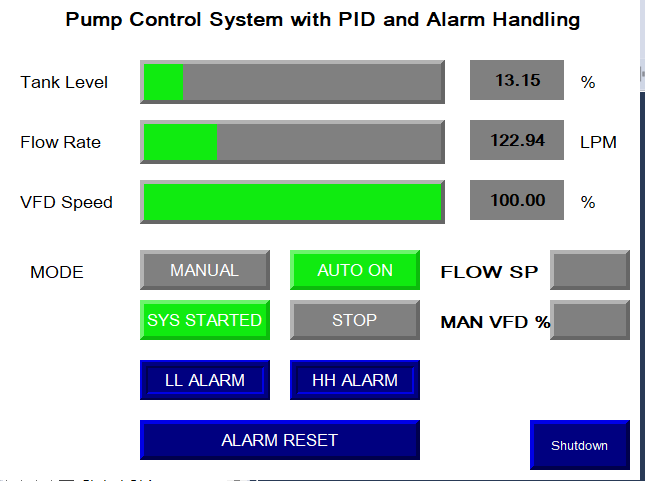
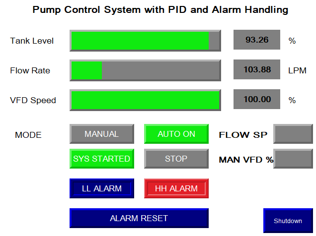

# 🚰 Project 2: Pump Control System with PID & Alarm Handling

This project simulates a real-world pump-tank automation system using **Rockwell Studio 5000** and **Logix Emulate**. It supports both **manual and PID-driven automatic modes**, with analog signal scaling, alarm latching, and modular ladder logic.

---

## 🧠 System Overview

- Manual & Auto mode with operator selection
- PID-based flow regulation with live analog scaling (4–20 mA)
- High/Low tank level alarm system with one-shot + latch logic
- Resettable alarms and mode indicators for HMI readiness
- Modular routines: `IO`, `CTRL`, `MODE_SELECTION`, `ALARMS_NOTIFICATION`
- Developed and tested using **emulator-compatible modules**

---

## 📄 Project Reports

### 1. Summary Report
Detailed system design, PID logic behavior, alarm structure, hardware setup, and test procedures.

<embed src="ProjectSummary_Pump Control System with PID and Alarm Handling.pdf" width="100%" height="600px" type="application/pdf">

[📥 Download Summary PDF](ProjectSummary_Pump Control System with PID and Alarm Handling.pdf)

---

### 2. Ladder Logic Overview
Structured ladder code screenshots for all key routines (JSRs, IO mapping, PID, alarms).

<embed src="LogicOverview_PumpControlSystem.pdf" width="100%" height="600px" type="application/pdf">

[📥 Download Logic PDF](LogicOverview_PumpControlSystem.pdf)

---

## 🖼️ HMI Screens (FactoryTalk View)

### Auto Mode Active with Normal Tank Level

### High-Level Alarm Active

These screens visualize:
- Process variables (Tank Level %, Flow LPM, VFD Speed %)
- Real-time system state: Manual vs Auto
- Alarm activation and reset handling
- Mode and start/stop control logic

---

[🔙 Back to Projects](../../projects)
