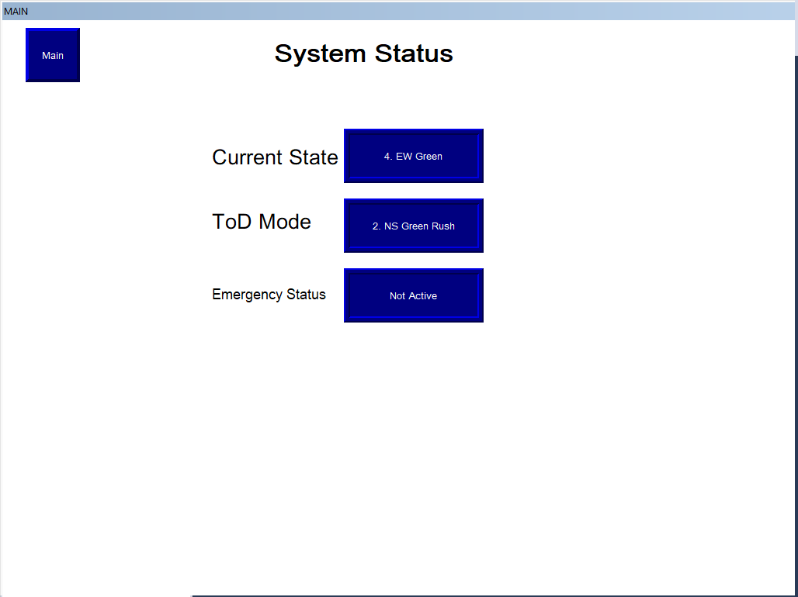
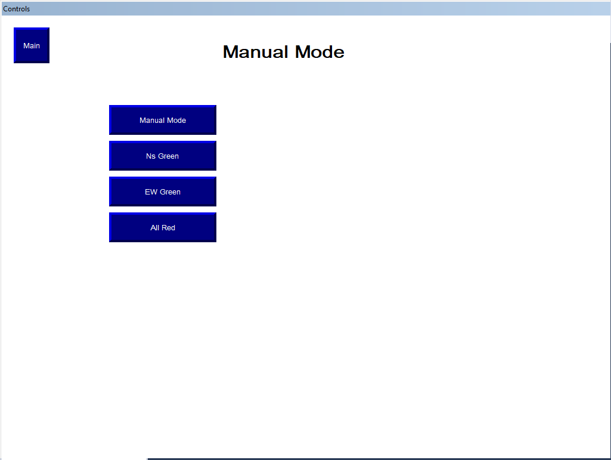
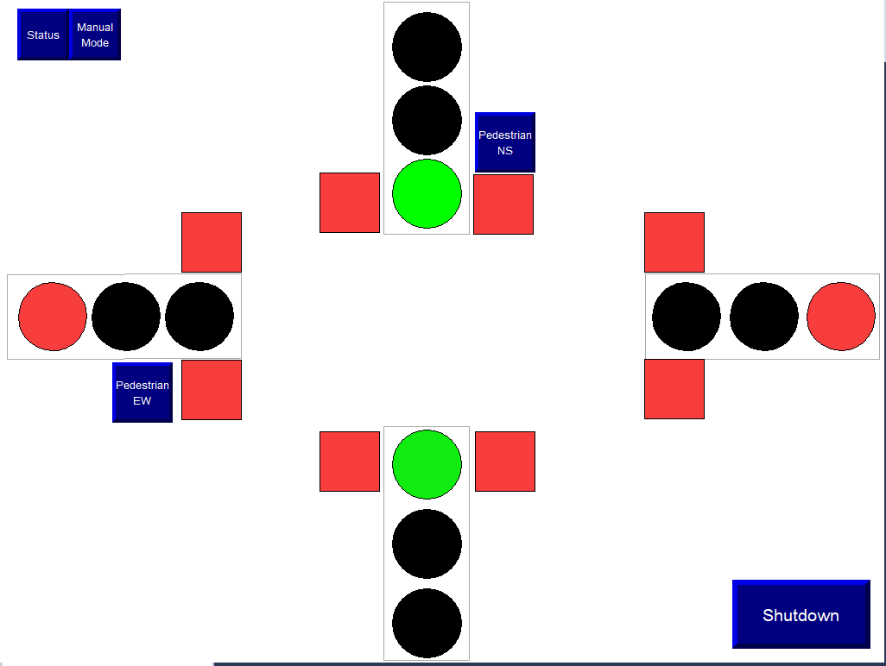

# Advanced Traffic Light Control System with Emergency Preemption

> **Technologies:** Rockwell Studio 5000 Logix Designer · ControlLogix 5570 Emulator  
> **Key Concepts:** State Machine Design · Time-of-Day Scheduling · Emergency Vehicle Preemption · Pedestrian Safety · Conflict Detection

---

##  Overview

A **comprehensive traffic intersection control system** implementing intelligent signal timing, emergency vehicle preemption, pedestrian crosswalk management, and safety conflict detection — built and validated entirely in **Studio 5000** with the **ControlLogix 5570 Emulator**.

This project demonstrates professional traffic control system design with real-world features including adaptive timing based on time-of-day, emergency vehicle priority routing, pedestrian walk signals with countdown timers, and critical safety interlocks.

---

##  Project Highlights

- **Multi-Mode Operation** — Auto/Manual/Night modes with seamless transitions and safe sequencing
- **Time-of-Day Scheduling** — Normal, Rush Hour (NS), Rush Hour (EW), and Night Mode with adaptive green times
- **Emergency Vehicle Preemption** — North-South and East-West emergency detection with immediate priority clearance
- **Pedestrian Safety System** — Walk/Don't Walk signals with flashing countdown and timing coordination
- **Conflict Detection** — Real-time monitoring prevents simultaneous green signals with automatic safety beacon activation
- **Modular State Machine** — Clean 6-state cycle: NS Green → NS Yellow → All Red → EW Green → EW Yellow → All Red
- **HMI Development** — Complete FactoryTalk View ME interface with real-time visualization and operator controls
- **Comprehensive Documentation** — Fully commented ladder logic with clear routine organization

---

## 🖥️ HMI Screenshots

### Main Visualization Screen

**Features:**
- Four-way intersection layout with real-time traffic light visualization
- Pedestrian walk/don't walk indicators (NS and EW)
- Interactive pedestrian request buttons
- System shutdown control
- Tab navigation for Status and Manual Mode

---

### System Status Dashboard

**Real-Time Monitoring:**
- Current State display (States 1-8 with descriptions)
- Time-of-Day Mode indicator (Night, Normal, Rush Hour NS, Rush Hour EW)
- Emergency Status indicator (Active/Not Active)
- Clean, at-a-glance system overview

---

### Manual Mode Controls

**Operator Control Panel:**
- Manual Mode enable/disable toggle
- Independent NS Green override
- Independent EW Green override
- All Red override for maintenance
- Direct operator control with safety interlocks maintained

---

### Intersection States

**State 1: NS Green Active**

- North-South direction: Green light active
- East-West direction: Red lights active
- Pedestrian signals coordinated with traffic flow

**All Red Clearance**

- All directions showing red
- 2-second intersection clearance
- Safety buffer between opposing flows

##  Project Documentation

### 1. Project Summary

<embed src="ProjectSummary_TrafficLightControl.pdf" width="100%" height="600px" type="application/pdf">

**Contents:**
- System objectives and scope
- Operating mode descriptions
- State machine architecture
- Safety system overview
- Testing methodology

### 2. Complete Ladder Logic

<embed src="LadderLogic_Complete.pdf" width="100%" height="600px" type="application/pdf">

**Contents:**
- All 9 routine implementations
- State machine logic (R05_Process_Logic)
- Emergency preemption (R04_Emergency_Mode)
- Pedestrian control (R07_Pedestrian_Handling)
- Output arbitration (R08_Lights_MappingOutputs)
- Time-of-day scheduling (R02_ToD_State)

---
##  Testing & Validation

**Complete test coverage achieved:**
- ✅ 13 functional tests (state machine, emergency preemption, pedestrian control)
- ✅ 6 safety tests (conflict detection, clearance intervals, emergency override)
- ✅ 4 time-of-day mode tests (normal, rush hour NS/EW, night mode)

All testing performed using **ControlLogix 5570 Emulator** in **Studio 5000 v33** with no physical hardware required.

---

---

##  Learning Outcomes

This project demonstrates proficiency in:
- **State Machine Design** - Timer-based sequencing with priority arbitration
- **Traffic Control Systems** - Signal phasing, emergency preemption, pedestrian safety
- **Safety-Critical Logic** - Conflict detection, clearance intervals, interlocking
- **Modular Architecture** - 9 organized routines with comprehensive documentation

---

[🔙 Back to Projects](../../projects)